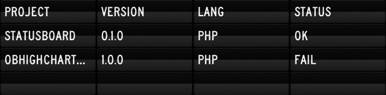
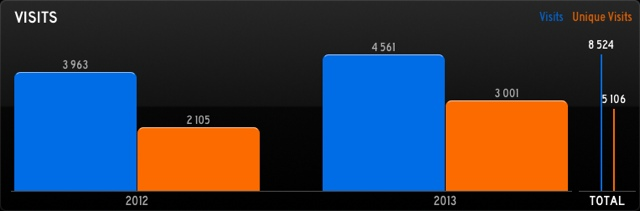

# StatusBoard

**StatusBoard** is a small PHP library that helps you render [StatusBoard](http://panic.com/statusboard/) widgets like
graphs and tables. It provides classes to handle tables, graphs and DIY widgets.

[](https://travis-ci.org/marcaube/StatusBoard)
[](https://scrutinizer-ci.com/g/marcaube/StatusBoard/)
[](https://scrutinizer-ci.com/g/marcaube/StatusBoard/)


## Usage

This project is not ready for use, come back later!


### Create a table widget

```php
<?php

require '../vendor/autoload.php';

// Create a Table widget
$widget = new StatusBoard\Widget\TableWidget();
$widget->setRows(array(
    array('Project', 'Version', 'Lang', 'Status'),
    array('StatusBoard', '0.1.0', 'PHP', 'Ok'),
    array('ObHighchartsBundle', '1.0.0', 'PHP', 'Fail')
));

// Register an HTML renderer
// You could also easily write your own renderer if the stock one doesn't fit your needs
$renderer = new StatusBoard\Renderer\WidgetRenderer();
$renderer->setRenderers(array(
    new StatusBoard\Renderer\HtmlRenderer()
));

echo $renderer->render($widget);
```

Add the table to StatusBoard app and you get this:




### Create a graph widget

```php
<?php

require '../vendor/autoload.php';

// Register an Json renderer
$renderer = new StatusBoard\Renderer\WidgetRenderer();
$renderer->setRenderers(array(
    new StatusBoard\Renderer\JsonRenderer()
));

// Create a Graph widget
$widget = new StatusBoard\Widget\GraphWidget();
$data1 = new \StatusBoard\Model\GraphData();
$data2 = new \StatusBoard\Model\GraphData();

// First dataset
$data1->setTitle('Visits')
    ->setColor('blue')
    ->addDataPoint('2012', 3963)
    ->addDataPoint('2013', 4561);

// Second dataset
$data2->setTitle('Unique Visits')
    ->setColor('orange')
    ->addDataPoint('2012', 2105)
    ->addDataPoint('2013', 3001);

$widget->setTitle("Visits")
    ->showTotal(true)
    ->addDataPoints($data1)
    ->addDataPoints($data2);

header('Content-Type: application/json');

echo $renderer->render($widget);
```

Add the graph to StatusBoard app and you get this:




### Create a DIY widget (a.k.a. HTML widget)

```php
<?php

require '../vendor/autoload.php';

// Create a DIY widget
$widget = new StatusBoard\Widget\DiyWidget();

// You should get your HTML from a template engine
$widget->setHtml('
    <style type="text/css">
        html,
        body,
        .container {
            margin: 0;
            padding: 0;
            overflow: hidden;
        }
        body {
            color: white;
            font-family: Roadgeek2005SeriesC, sans-serif;
        }
        .container {
            text-align: center;
        }
        h1 {
            font-size: 60px;
            line-height: 120px;
            margin-top: 50px;
        }
    </style>
    <div class="container">
        <h1>HTML!</h1>
    </div>
');

// Register an HTML renderer
$renderer = new StatusBoard\Renderer\WidgetRenderer();
$renderer->setRenderers(array(
    new StatusBoard\Renderer\HtmlRenderer()
));

echo $renderer->render($widget);
```

Add the graph to StatusBoard app and you get this:


## Installation

You can install StatusBoard using composer, just create a `composer.json` file for your project:

```json
{
    "require": {
        "ob/statusboard": "*"
    }
}
```

And run these two commands to install it:

```bash
$ curl -sS https://getcomposer.org/installer | php
$ composer install
```

Now, you just have to `require` the autoloader in your project to have access to the library:

```php
<?php

require 'vendor/autoload.php';
```

Voilà!


## Requirements

- PHP >= 5.3


## Contributing

See the [CONTRIBUTING.md](CONTRIBUTING.md) file.


## Running the tests

If not done already, install the dependencies and generate the autoloader with composer:

```bash
$ curl -sS https://getcomposer.org/installer | php
$ composer install --dev
```

Once installed, just run the following command:

```bash
$ phpunit -c tests/
```

You can also check for code coverage:

```bash
$ phpunit --coverage-text -c tests/
```


## Credits

Thanks to [Panic](http://panic.com) for their affordable, easy to hack [StatusBoard](http://panic.com/statusboard/)
application.


## License

StatusBoard is released under the MIT License. See the bundled [LICENSE](LICENSE) file for details.